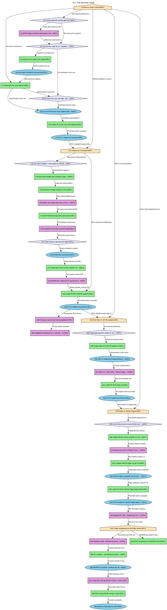

# rwc: A Deciduous Demo

> **Building a Rust `wc` clone, compiled to WebAssembly, with every decision tracked.**

This repository demonstrates [deciduous](https://github.com/notactuallytreyanastasio/deciduous) — a decision graph tool designed for AI-assisted development. It captures the *why* behind code changes, not just the *what*.

## Live Demo

- **[rwc Web App](https://notactuallytreyanastasio.github.io/deciduous_example/)** — Upload a file, get word/line/byte counts powered by Rust + WASM
- **[Decision Graph Viewer](https://notactuallytreyanastasio.github.io/deciduous_example/graph/)** — Explore the full decision tree that built this project

## The Journey

This project was built entirely through AI-assisted development with Claude, using deciduous to track every decision, observation, and outcome in real-time. The result: **50 nodes and 57 edges** documenting the complete thought process.

### What We Built

```
Rust CLI (wc clone) → WASM compilation → Web UI → GitHub Pages deployment
```

All tracked. All linked. All visible.

---

## How Deciduous Works with Claude

Deciduous isn't meant to be a CLI you memorize. It's designed to be used by Claude (or other AI assistants) as a **thinking-out-loud tool** that creates an auditable trail of decisions.

### The CLAUDE.md Instructions

Add this to your project's `CLAUDE.md`:

```markdown
## Decision Graph Workflow

**THIS IS MANDATORY. Log decisions IN REAL-TIME, not retroactively.**

### Behavioral Triggers - MUST LOG WHEN:

| Trigger | Log Type | Example |
|---------|----------|---------|
| User asks for a new feature | `goal` | "Add dark mode" |
| Choosing between approaches | `decision` | "Choose state management" |
| About to write/edit code | `action` | "Implementing Redux store" |
| Something worked or failed | `outcome` | "Redux integration successful" |
| Notice something interesting | `observation` | "Existing code uses hooks" |

### Quick Commands

```bash
deciduous add goal "Title" -c 90        # Confidence 0-100
deciduous add decision "Title" -c 75
deciduous add action "Title" -c 85
deciduous link FROM TO -r "reason"
deciduous sync                          # Export for viewing
```
```

That's it. Claude handles the rest.

---

## Real Examples from This Project

### Phase 1: The Initial Goal

When asked to build a `wc` clone, Claude logged:

```bash
deciduous add goal "Build wc clone in Rust" -c 95 \
  -d "Replicate core wc functionality: word count and line count (-l) for regular files. Keep it dependency-minimal. Will later compile to WASM for web UI."
```

**Node 1** was born. Every subsequent decision links back to it.

### Phase 2: Making Architectural Choices

Before writing any code, Claude faced a decision: how to handle argument parsing?

```bash
deciduous add decision "Choose argument parsing approach" -c 80 \
  -d "Need to decide: use clap/structopt, roll our own minimal parser, or use std::env::args directly."

deciduous add observation "WASM target constrains dependency choices" -c 90 \
  -d "Since we plan to compile to WASM, we need dependencies that support wasm32 target."

deciduous add decision "Use std::env::args for CLI, separate core logic" -c 85 \
  -d "Keep argument parsing minimal. Core counting logic in separate module for WASM portability."

deciduous link 2 3 -r "Observation informs the decision"
deciduous link 3 4 -r "Observation leads to this decision"
```

The graph shows the reasoning chain: Goal → Decision Point → Observation → Resolution.

### Phase 3: Handling Unexpected Issues

When the WASM build failed because Homebrew Rust lacked the `wasm32` target:

```bash
deciduous add observation "Homebrew Rust lacks wasm32 target" -c 80 \
  -d "System uses Homebrew-installed Rust, not rustup. Need to either install wasm32 target manually or use rustup."

deciduous add decision "Install rustup to get wasm32 target" -c 85 \
  -d "Installing rustup is the standard way to get cross-compilation targets."
```

The obstacle and its resolution are permanently linked in the graph.

### Phase 4: PR Writeups with Context

When creating pull requests, deciduous generates writeups that include the decision context:

```bash
deciduous writeup -t "feat: add WebAssembly support" -n 12-24
```

This pulls nodes 12-24 and generates a PR description showing:
- The goal being achieved
- Key decisions made
- Implementation actions taken
- Outcomes observed

---

## The Decision Graph

### Full Project Graph



### Node Types

| Shape | Type | Purpose |
|-------|------|---------|
| 🏠 House | **Goal** | What we're trying to achieve |
| 💎 Diamond | **Decision** | A choice point with alternatives |
| 📦 Box | **Action** | Something we did |
| 🔵 Ellipse | **Outcome** | Result of an action |
| 📝 Note | **Observation** | Something we noticed |

### Reading the Graph

Edges flow from cause to effect:
- Goals spawn decisions
- Decisions lead to actions
- Actions produce outcomes
- Observations inform decisions

The confidence percentage (e.g., `90%`) indicates how certain we were at that moment.

---

## Project Structure

```
.
├── src/
│   ├── lib.rs          # Core counting functions (WASM-exported)
│   └── main.rs         # CLI interface
├── index.html          # Web UI (static, no build step)
├── pkg/                # WASM build output (generated)
├── .deciduous/
│   └── deciduous.db    # Decision graph database
├── docs/
│   └── *.png           # Decision graph visualizations
└── .github/workflows/
    └── deploy.yml      # GitHub Pages deployment
```

---

## Using the CLI

### Installation

```bash
cargo install rwc
```

### Usage

```bash
# Count lines, words, and bytes (like wc)
rwc file.txt

# Count lines only (like wc -l)
rwc -l file.txt
```

### Output Format

```
42 156 892 file.txt
│   │   │
│   │   └── bytes
│   └────── words
└────────── lines
```

---

## Building from Source

### Prerequisites

- Rust (via rustup recommended)
- wasm-pack (for WASM build)
- graphviz (for decision graph PNGs)

### Build CLI

```bash
cargo build --release
```

### Build WASM

```bash
wasm-pack build --target web
```

### Run Tests

```bash
cargo test
```

---

## Deciduous CLI Reference

### Adding Nodes

```bash
deciduous add <type> "Title" [-c confidence] [-d "description"]
```

Types: `goal`, `decision`, `action`, `outcome`, `observation`

### Linking Nodes

```bash
deciduous link <from_id> <to_id> -r "reason"
```

### Viewing the Graph

```bash
deciduous nodes          # List all nodes
deciduous edges          # List all edges
deciduous serve          # Start local web viewer (http://localhost:3000)
deciduous sync           # Export to docs/graph-data.json for GitHub Pages
```

### GitHub Pages Deployment

After `deciduous init`, your project is ready for GitHub Pages:

```bash
deciduous sync                              # Export graph to docs/
git add docs/ .github/ && git push         # Push to trigger deploy
```

Then enable Pages: **Settings → Pages → Source: Deploy from branch → `gh-pages`**

Your graph will be live at `https://<user>.github.io/<repo>/`

### Exporting

```bash
deciduous dot -o graph.dot                    # DOT format
deciduous dot --png -o graph.png              # PNG (requires graphviz)
deciduous writeup -t "PR Title" -n 1-10       # PR writeup
```

### Context Recovery

```bash
deciduous nodes          # See what exists
deciduous edges          # See connections
```

Use `/context` slash command in Claude Code to auto-recover session state.

---

## Why Track Decisions?

1. **Audit Trail** — Know why code exists, not just what it does
2. **Context Recovery** — Resume work after breaks without losing thread
3. **PR Quality** — Generate writeups that explain the reasoning
4. **Team Knowledge** — Decisions persist beyond individual memory
5. **AI Alignment** — See exactly how the AI approached problems

---

## Links

- [deciduous](https://github.com/notactuallytreyanastasio/deciduous) — The decision graph tool
- [Live Demo](https://notactuallytreyanastasio.github.io/deciduous_example/) — This project's web app
- [Graph Viewer](https://notactuallytreyanastasio.github.io/deciduous_example/graph/) — Interactive decision graph

---

*Built with Claude Code + deciduous. 50 decisions tracked, 0 context lost.*
