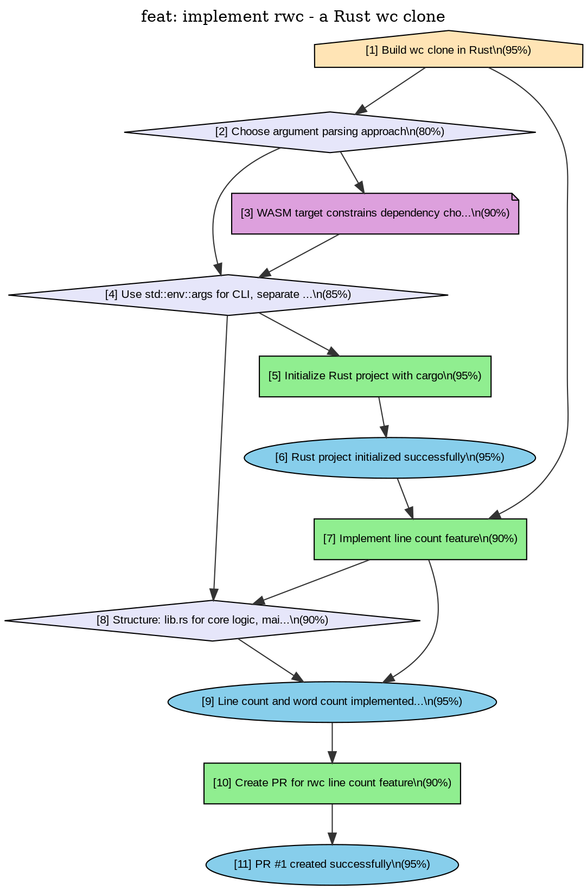

## Summary

**Goal:** Build wc clone in Rust

Replicate core wc functionality: word count and line count (-l) for regular files. Keep it dependency-minimal. Will later compile to WASM for web UI.

## Key Decisions

### Choose argument parsing approach

**Observations:**

- WASM target constrains dependency choices

### Use std::env::args for CLI, separate core logic

**Observations:**

- WASM target constrains dependency choices

### Structure: lib.rs for core logic, main.rs for CLI

## Implementation

- Initialize Rust project with cargo
- Implement line count feature
- Create PR for rwc line count feature

## Outcomes

- Rust project initialized successfully (95% confidence)
- Line count and word count implemented successfully (95% confidence)
- PR #1 created successfully (95% confidence)

## Decision Graph

*Render with: `dot -Tpng graph.dot -o graph.png`*

## Test Plan

- [ ] Verify implementation
- [ ] Run test suite

## Decision Graph Reference

This PR corresponds to deciduous nodes: 1, 2, 3, 4, 5, 6, 7, 8, 9, 10, 11

